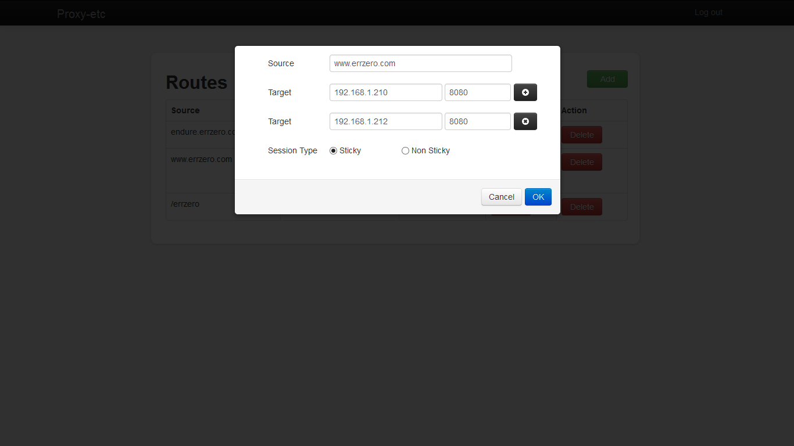

proxy-etc
=========

Dynamic reverse proxy based on node js.  It uses [etcd](https://github.com/coreos/etcd) to dynamically switch application

#### Features :
 1. Configure via REST.
 2. TCP proxy [for mysql]
 3. HTTP/HTTPS reverse proxy
 4. Avoid dog pile effect.
 5. It uses etcd to dynamically switch application 
 6. Load balancing (support sticky and non sticky with auto update of failed nodes)
 7. UI for viewing and editing URL mappings.
 8. Auto detection of server node failure and send alert as email 
 9. Store mapping info in a file or inbuilt lightweight db to persist the URL mappings (to get back mapping info after proxy server restart or crash )
 
 
#### How to get going :
 
 1. Install Node.js for your operating system.
 2. Create a folder for tingoDB in local system.
 3. Get a copy of code - https://github.com/bbytes/proxy-etc.git to your local directory.
 4. Run the command - npm install -d - in Node command prompt after changing to your cloned directory.
    This should install the dependencies currently added in package.json file.
 5. Set path of your tingoDB folder to dbPath property in config/config.js.
 6. Set hostname and port on which u want to run your proxy-etc.
 6. User credentials for the application in config.js file.
    
 
#### Running the application : 

 1. From the command prompt run - node app.js . You should be able to see a Login page at http://localhost:3333/proxy.
 2. Login with Admin user credentials : Username : admin, Password : admin
 3. Add routes to proxy-etc. For example : source : www.errzero.com, host : 192.168.1.179, port : 8080
 4. Now you can access errzero running on 192.168.1.179 machine from proxy-etc url www.errzero.com.

      There wiil be two instances of servers. One for UI as Configurad in config.js __app__ property. Another instance for reverse proxy as configured in __http__ and __https__ properties in config.js.
            

#### Configuring the server

		dbPath : 'C:/tingoDB/data',
		maxSockets : 500,
		workers : 4,
		tcpTimeout : 90,
		httpKeepAlive : true,
		//UI
		app : {
			name : 'proxy-etc',
			hostname : 'localhost',
			port : 3333,
		},
		http : {
			hostname : 'localhost',
			port : 80,
		},
		https : {
			hostname : 'localhost',
			port : 443,
			keyPath : './config/keys/errzero.private.pem',
			certPath : './config/keys/errzero.public.pem'
		},
		memoryMonitor : {
			memoryLimit : 100, //MBs
			gracefulWait : 30, //seconds
			checkInterval : 60 //seconds
		},
		credentials : {
			username : "admin",
			password : "admin"
		}
              
 * __dbPath__ : Path to tingoDB folder
 * __maxSockets__ : The maximum number of sockets which can be opened on
each backend (per worker)
 * __workers__ : Number of workers to be spawned (specify at least 1, the
master process does not serve any request)
 * __https__ : SSL configuration (omit this section to disable HTTPS) 
 

## Features implemented 

### Configure via REST 
  Routes can be added or removed or updated using rest.

### HTTP/HTTPS reverse proxy
  Supports both HTTP and HTTPS

### Load balancing
  Multiple backends can be attached to a frontend. Session type property can be added to route json to make it sticky or non-sticky. 
  
 * __Sticky Session__ : It keep your sessions tied to the same target. Proxy-etc is adding cookie to first response and checks the subsequent requests for the cookie added. If finds the cookie forwards request to same target.
 * __Non-sticky Session__ : Requests are distributed to all the targets equally. 

### UI for viewing and editing URL mappings

### Multi-process architecture
To optimize response times and make use of all your available cores, Proxy-etc uses the cluster module (included in NodeJS), and spreads the load across multiple NodeJS processes. A master process is in charge of spawning workers and monitoring them. When a worker dies, the master spawns a new one.

### Memory monitoring
Each worker monitors its memory usage. If it crosses a given threshold, the worker stops accepting new connections, it lets the current requests complete cleanly, and it stops itself; it is then replaced by a new copy by the master process.

### TO-DO
* __Auto detection of server node failure and send alert as email__
* __OS integration__
* __TCP proxy [for mysql]__
* __Avoid dog pile effect__
* __etcd to dynamically switch application__    
